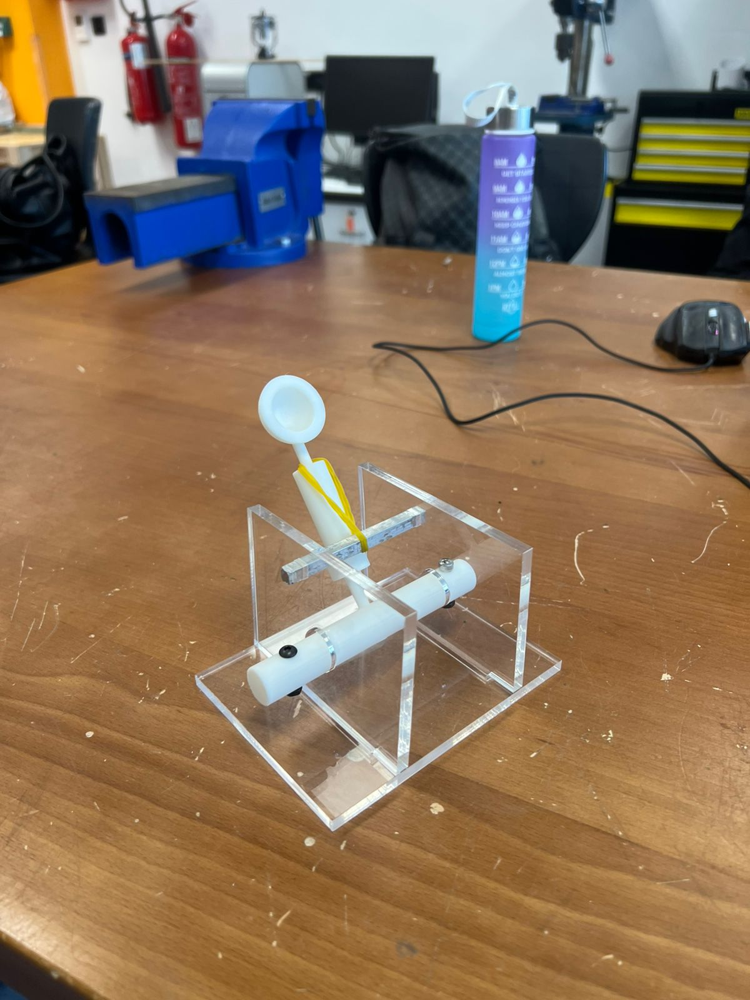
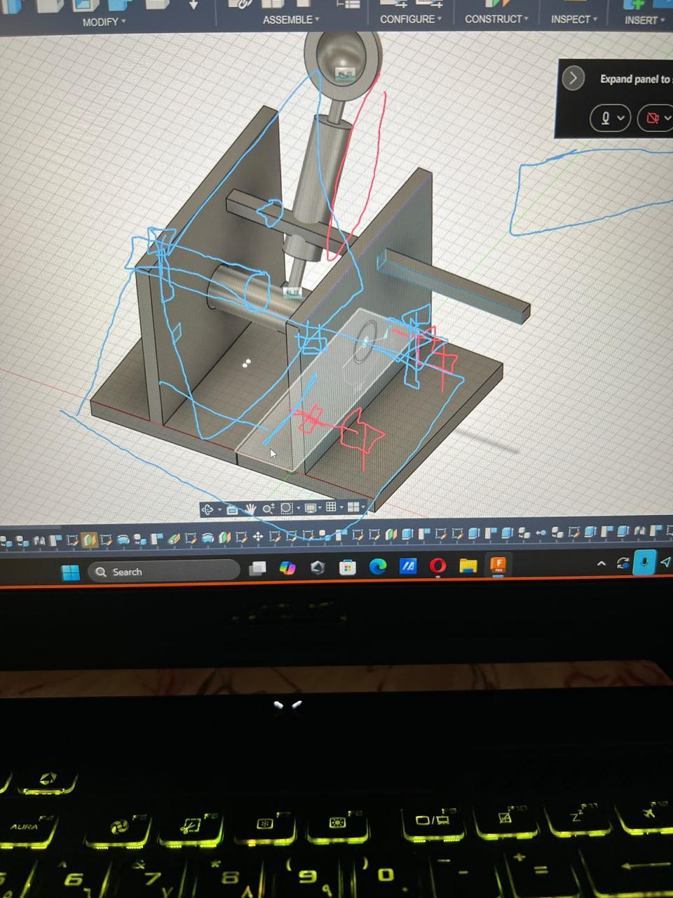
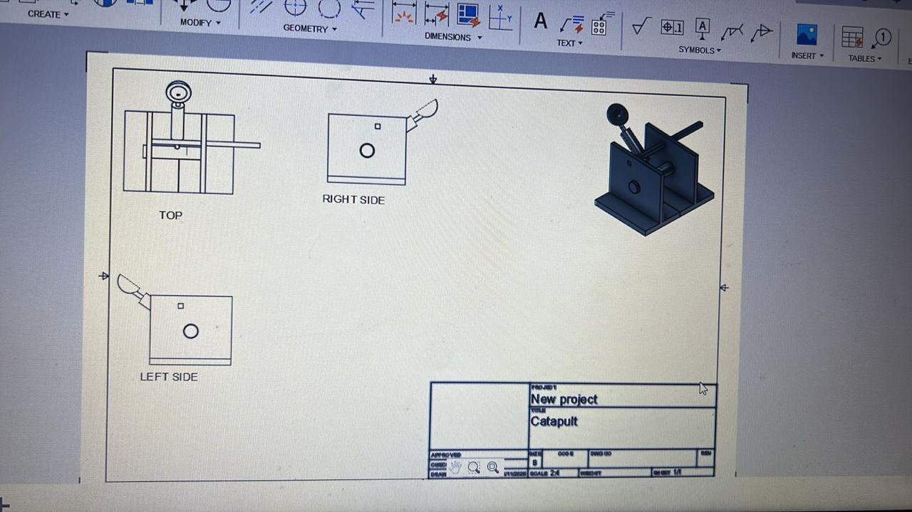
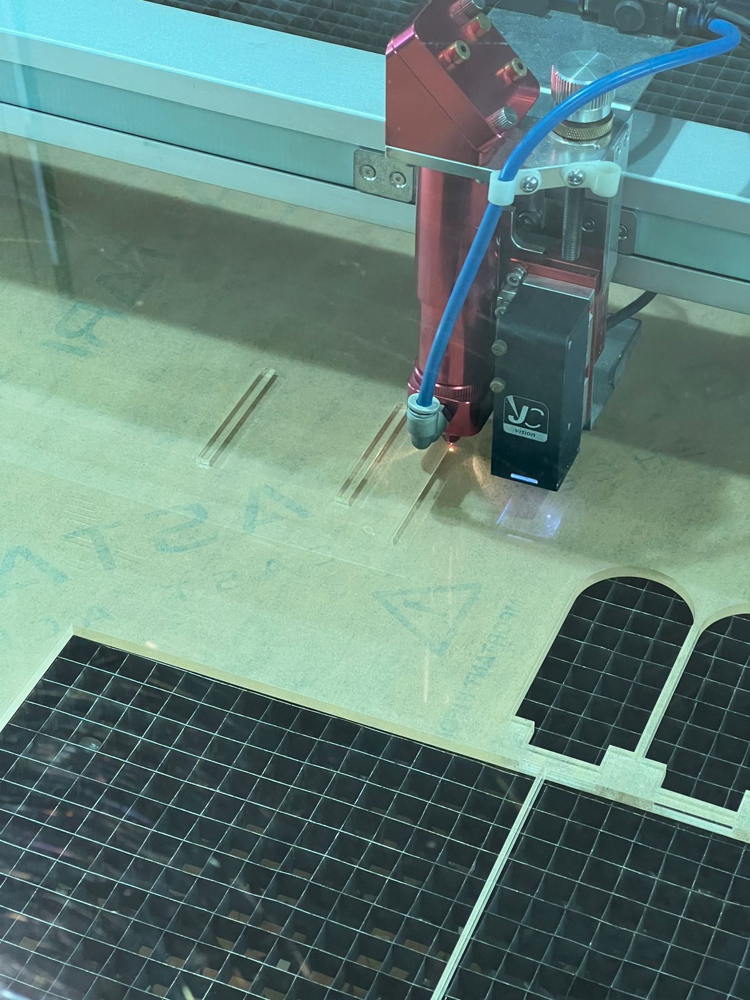
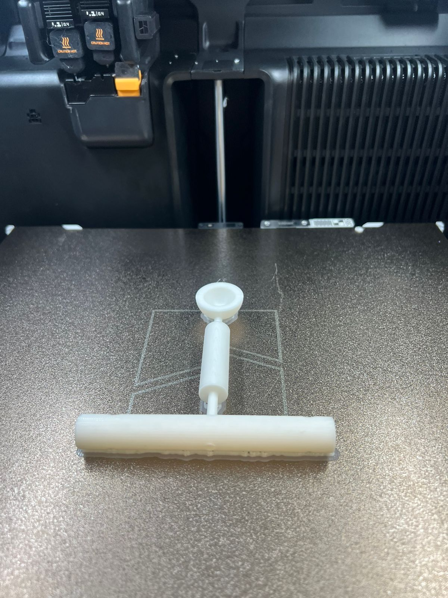

# Catapult Design and Manufacturing

A compact rubber-band-powered catapult designed in Autodesk Fusion 360 and manufactured as a three-person MMMB203 engineering project at the University of Wollongong in Dubai.



## Project overview

The project combined CAD modelling, engineering drawings, manufacturing, and assembly to produce a working projectile-launching mechanism within a **200 × 200 × 200 mm** size constraint. The report gives an approximate assembly size of **130 × 130.15 × 111.95 mm**.

The build used laser-cut acrylic for the base and side plates, a PLA-printed arm/holder/pivot assembly, and a metal rod and fasteners. A stretched rubber band stores elastic potential energy and drives the arm when released.

## Team and contribution

- **Hamza Almandhari — 33.33%**
- **Zarak Khan — 33.33%**
- **Siddharth Saroday — 33.33%**

These percentages are recorded in the submitted contribution sheet. This repository presents our shared team work; the report does not allocate individual manufacturing or CAD tasks to specific members.

## Design and manufacturing

| Area | Work completed |
| --- | --- |
| CAD | Fusion 360 assembly modelling, orthographic drawings, exploded view, and parts list |
| Laser cutting | Base and two side plates made from 6 mm acrylic |
| 3D printing | PLA rotating arm, projectile cup, and pivot assembly; report settings: 0.2 mm layers and 15% infill |
| Metalworking | Rod preparation, manual lathe work described in the report, and grinding of rough ends |
| Assembly | Pivot alignment, fastening, rubber-band installation, and fit checks |

The original report alternates between steel and aluminium when describing the rod, so its exact material is not asserted here.

## How it works

1. The side plates support the pivot and rotating arm.
2. Pulling the arm back stretches the rubber band.
3. Releasing the arm converts stored elastic energy into arm motion and launches the projectile.
4. Fasteners retain the pivot, while the base and anchor support the mechanism.

## Problems solved

- **Loose side-plate fit:** the original left/right leg arrangement was replaced with two matching right-leg profiles to improve stability.
- **Rod fit:** rough rod ends prevented insertion through the side-plate holes. Grinding the ends allowed assembly.

The main lesson was the importance of fit, alignment, and tolerances when combining acrylic, printed polymer parts, and metal components.

## Photos and demonstrations

[Catapult demonstration](videos/catapult-demonstration.mp4) · [Workshop test video](videos/workshop-test.mp4)

These clips document the prototype and workshop testing. No measured launch range, accuracy, or repeatability results are claimed.

| CAD assembly | Engineering drawing |
| --- | --- |
|  |  |

| Laser cutting | Printed arm and pivot |
| --- | --- |
|  |  |

Additional manufacturing and assembly photos are in [images](images/).

## Project documentation

[Download the submitted report](docs/MMMB203_Catapult_Report.docx), including the parts list, manufacturing process, and engineering drawings.

```text
catapult-design-and-manufacturing/
├── README.md
├── docs/
│   └── MMMB203_Catapult_Report.docx
├── images/
│   └── CAD, manufacturing, and assembly photos
└── videos/
    ├── catapult-demonstration.mp4
    └── workshop-test.mp4
```

This is a mechanical design and manufacturing project, with no programming component. Native Fusion 360, STL, and DXF files are not included in the supplied materials; the report and photos document the design.

## Public report copy

Administrative cover/contribution sheets containing student IDs or signatures have been removed from the shared report copies. Team credits remain in this README.
