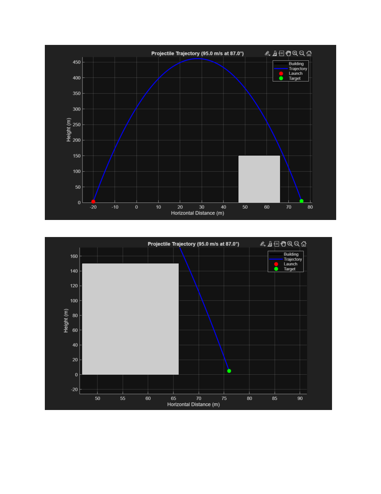
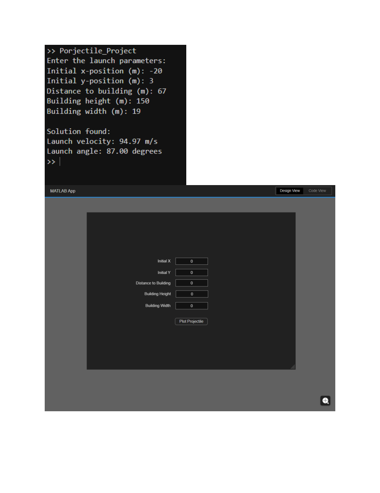

# MATLAB Projectile Trajectory Simulator

A MATLAB-based engineering simulation developed for an ENGG100 project. The program determines projectile launch conditions that allow an object to travel from a chosen launch point to a target while clearing a building obstruction.

## Project Summary

This was a **3-person engineering team project**. The submitted contribution sheet recorded an equal **33.33% contribution per team member**.

The project combines projectile-motion theory with MATLAB numerical simulation and visualization.

## What the Program Does

- Accepts launch coordinates.
- Accepts the distance to the building.
- Accepts building height and width.
- Sets the target 10 m beyond the building and 5 m above ground.
- Searches launch angles from 1° to 89°.
- Calculates the required launch velocity.
- Checks multiple points across the full building width to make sure the projectile clears it.
- Uses a 0.1 m clearance margin.
- Calculates and plots the projectile trajectory.
- Shows the building, launch point, and target.
- Reports when no valid trajectory is found.

## Engineering Concepts

- Projectile motion
- Kinematics
- Newtonian mechanics
- Horizontal and vertical velocity components
- Gravitational acceleration
- Numerical iteration
- Engineering visualization

## Technologies

- MATLAB
- MATLAB plotting
- Engineering dynamics / kinematics

## Example Output

The report includes example trajectory plots and a MATLAB interface prototype.





## Repository Structure

```text
matlab-projectile-trajectory-simulator/
├── src/
│   └── projectile_simulation.m
├── images/
│   ├── trajectory_results.png
│   └── matlab_interface.png
├── docs/
│   └── ENGG100_FinalReport.pdf
├── .gitignore
└── README.md
```

## How It Works

The script loops through possible launch angles and calculates the velocity required to reach the target. For each candidate trajectory, it evaluates the projectile height at multiple points while it is horizontally above the building.

The first trajectory that clears the full building width is accepted and plotted.

## Team Project

This project was completed by a team of three students as part of ENGG100. The submitted contribution sheet recorded an equal contribution from all three team members.

## My Contribution

I contributed to the development and completion of the project as one of the three team members, including the MATLAB-based engineering simulation and project documentation.

## Possible Improvements

- Add stronger input validation.
- Separate the physics calculations into reusable MATLAB functions.
- Optimize for minimum launch velocity instead of selecting the first valid angle.
- Rebuild the GUI as a complete MATLAB App Designer application.
- Add automated test cases.
- Extend the simulation to include air resistance or full 3D motion.

## Academic Context

ENGG100 — Engineering project involving projectile-motion analysis and MATLAB simulation.

## Public report copy

Administrative cover/contribution sheets containing student IDs or signatures have been removed from the shared report copies. Team credits remain in this README.
