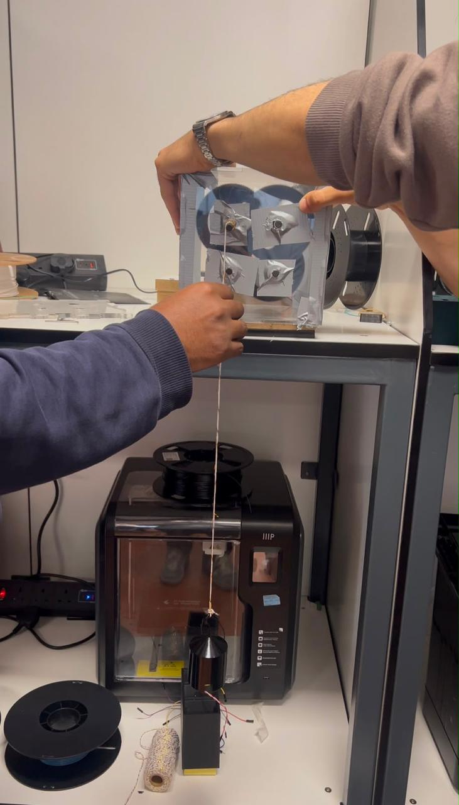
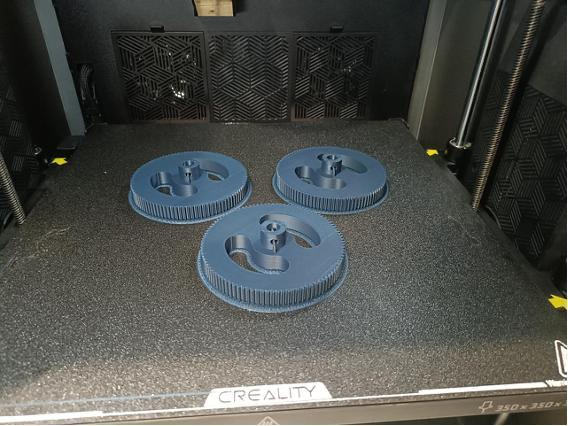
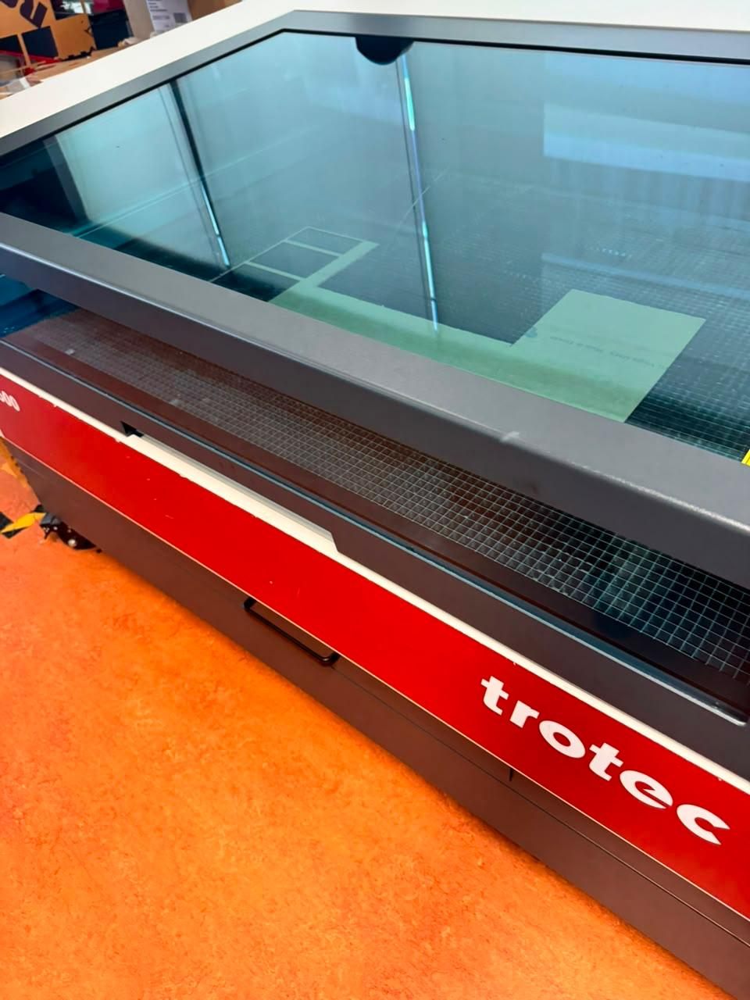
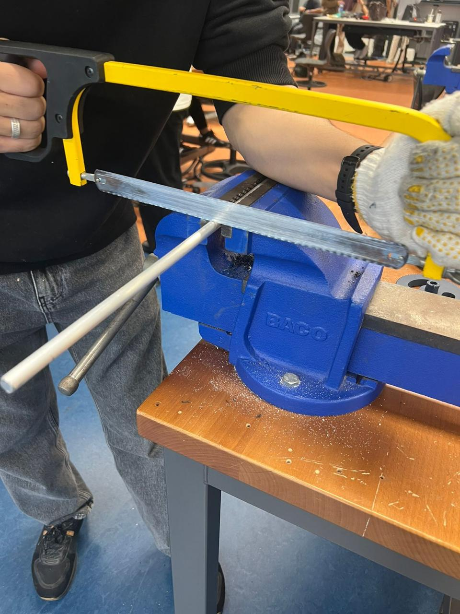
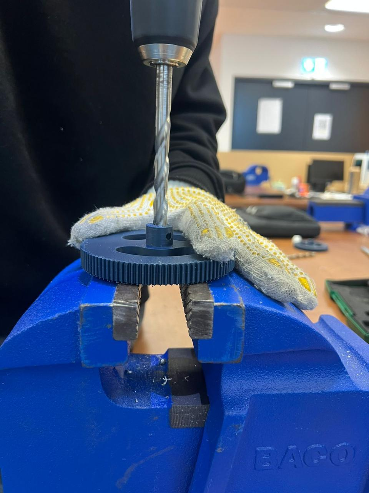
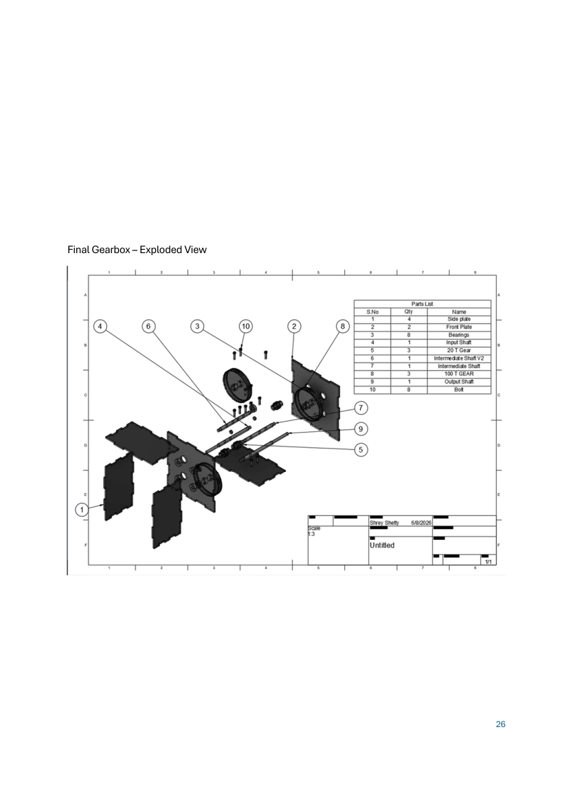

# Three-Stage Winch Gearbox

A mechanical design and manufacturing project for **MMMB215 — Mechanical Design 1** at the University of Wollongong in Dubai. Our team developed a compact three-stage spur-gear reduction system for a model winch.



## Project objective

Design a gearbox to lift a **1 kg load through 1.2 m in 10–20 seconds**, using a motor specified at **11,000 rpm and 2.1 W**. The reports describe a maximum 200 × 200 mm housing envelope, a maximum 5:1 ratio per stage, and a 250 AED budget.

These are project requirements. The supplied material documents design, analysis, CAD components, and prototype manufacturing; it does not provide measured lifting-time, efficiency, or load-test results.

## Design overview

| Feature | Documented design |
| --- | --- |
| Gear train | Three reduction stages across four shafts |
| Reduction | 5:1 per stage; 125:1 overall |
| Nominal output speed | 88 rpm, calculated from 11,000 / 125 |
| Gears in Progress Report 2 | 20-tooth pinions and 100-tooth gears; PLA, 3D printed |
| Housing | Acrylic panels, laser cut |
| Shafts | Aluminium; input, two intermediate shafts, and output |
| Bearing arrangement | 608 bearings with 8 mm bore, 22 mm outside diameter, and 7 mm width, as specified in the reports |
| Design software | Autodesk Fusion 360 |

## Engineering work

- Generated concepts using a morphological chart and compared them with a weighted Pugh matrix.
- Selected Concept 1, which received a reported score of 198.
- Calculated gear reduction, output speed, gear dimensions, and torque requirements.
- Analysed the output shaft under bending and torsion, including bearing reactions and shear-force/bending-moment diagrams.
- Applied von Mises stress, Modified Goodman fatigue analysis, and bearing-life calculations in the submitted report.
- Produced component drawings, an exploded assembly view, and a bill of materials.
- Fabricated parts using 3D printing, laser cutting, and metalworking, then assembled the prototype.

### Analysis scope

Progress Report 2 models an 8 mm output shaft with a 100 mm overhang carrying the drum load. It reports a maximum bending moment of 0.981 N·m, a nominal torque of 0.118 N·m, and a calculated yield factor of safety of 2.50 under its stated assumptions.

The analytical results in the PDFs are the team's submitted calculations, not independently validated performance or durability measurements. Fatigue and bearing-life estimates depend on the material data, loading, geometry, and simplifying assumptions used in those reports.

### Design development

The concept report uses 12/60-tooth gears; Progress Report 2 includes 20/100-tooth gear drawings. Both give a 5:1 stage ratio. The later report is used for the overview above. The reports also contain differing load, power, and geometry assumptions, so their calculations should be read in the context of each design stage rather than combined as one final specification.

## Team

This was a **four-person team project**. Progress Report 2 records:

| Team member | Contribution recorded for Progress Report 2 |
| --- | --- |
| Hamza Al Mandhari | 30% |
| Zarak Khan | 30% |
| Shrey Shetty | 30% |
| Shaurya Shetty | 10% |

These percentages refer to that report's contribution sheet. Individual CAD and workshop tasks are not assigned to specific members in this README because the supplied reports do not establish that breakdown.

## Manufacturing gallery

| Printed gears | Laser cutting |
| --- | --- |
|  |  |

| Shaft stock preparation | Gear hub work |
| --- | --- |
|  |  |

More build photos are in [images](images/).

## Reports and drawings

- [Concept and design report](docs/Gearbox_Concept_and_Design_Report.pdf): requirements, concept selection, gearing calculations, and early design.
- [Progress Report 2](docs/MMMB215_Progress_Report_2.pdf): shaft/loading analysis, bearing calculations, component drawings, exploded assembly, and BOM.



## Fusion 360 files

Seven supplied native `.f3d` files are included in [cad](cad/):

- [Input shaft](cad/input-shaft.f3d)
- [Intermediate shaft 1](cad/intermediate-shaft-1.f3d)
- [Intermediate shaft 2](cad/intermediate-shaft-2.f3d)
- [Output shaft](cad/output-shaft.f3d)
- [Front and back housing panels](cad/front-and-back-gear-box.f3d)
- [Side panel 1](cad/sides-1.f3d)
- [Side panel 2](cad/sides-2.f3d)

Download and open these files in Autodesk Fusion 360. They are preserved from the supplied exports and have not been opened or rebuilt in Fusion 360 here. The supplied native files cover shafts and housing panels; gear models and a complete native assembly are not included. Their drawings can be viewed in the reports.

## Repository structure

```text
three-stage-winch-gearbox/
├── README.md
├── cad/       # Seven native Fusion 360 component files
├── docs/      # Two original project reports
└── images/    # Seven build photos and an extracted assembly drawing
```

## Further documentation

Useful additions would include measured lifting time, input/output speed under load, assembly clearances, final gear-to-shaft connection details, and the complete Fusion 360 assembly. Progress Report 2 identifies fastener lengths, finger-joint tolerances, housing tolerances, and internal orientation as items still to be finalized at that reporting stage.

## Public report copy

Administrative cover/contribution sheets containing student IDs or signatures have been removed from the shared report copies. Team credits remain in this README.
