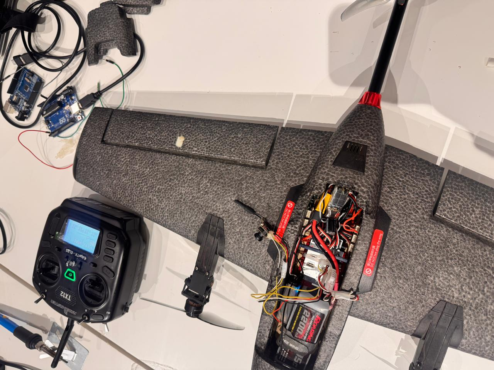
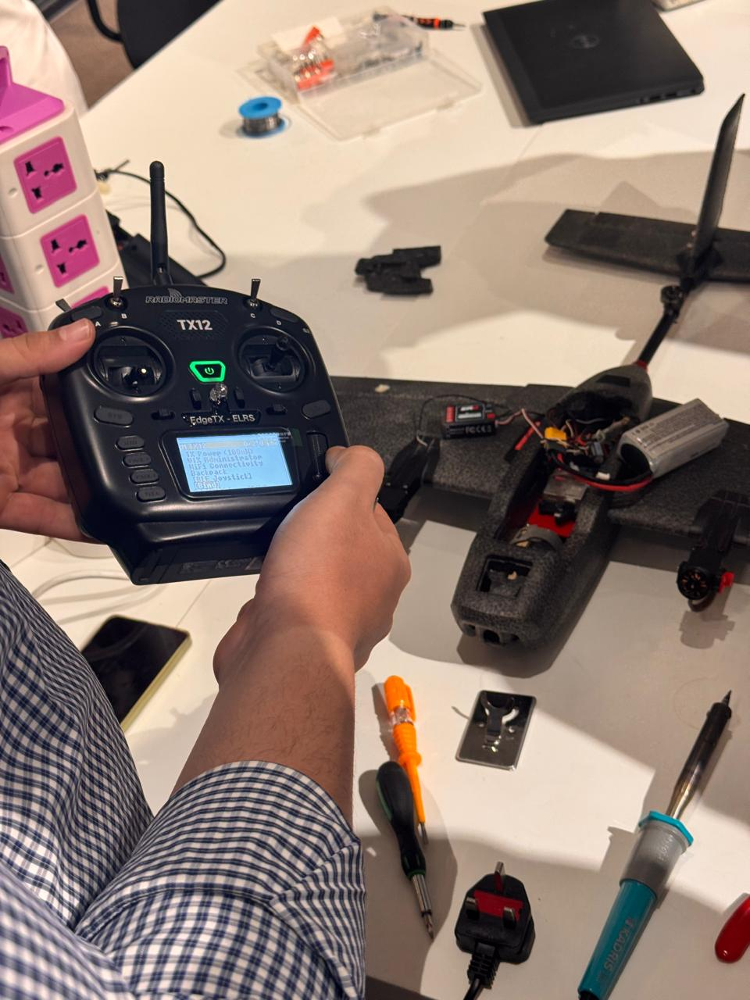
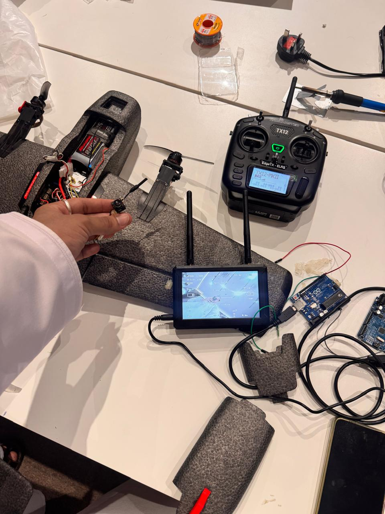
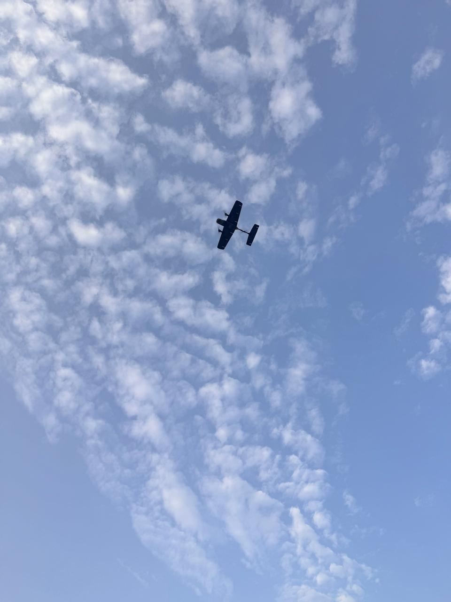

# VTOL Drone Design and Manufacturing

A portfolio of my summer **VTOL Drone Manufacturing** course, documenting aircraft setup, a Fusion 360 CAD export, flight footage, and my completion certificate.



## Training

| Detail | Certificate information |
| --- | --- |
| Participant | Hamza Al-Mandhari |
| Course | VTOL Drone Manufacturing |
| Issuer | Under Control |
| Training dates | 14 July–3 August 2026 |
| Duration | 48 hours |
| Certificate issued | 3 August 2026 |

The supplied Arabic outline is titled **FPV Maker — Design, Build, Configuration, and Flight (Drone Course 2)**. An [English translation](docs/course-outline-en.md) is included.

## Course focus

The course outline covers the design, construction, configuration, and testing of a three-motor vertical take-off and landing aircraft. It combines mechanical design with flight-control hardware and firmware integration.

Its learning objectives include:

- VTOL flight principles and aerodynamics.
- Lightweight airframe design and assembly.
- Pixhawk installation and PX4 firmware configuration.
- Brushless motor, servo, and flight-sensor calibration.
- Transition control between vertical and forward flight.
- Ground testing, flight testing, and troubleshooting.

These are the course's stated objectives. The supplied files document my course participation and associated project work; they do not establish that I independently designed every subsystem or wrote custom flight-control software.

## Project evidence

- **Certificate:** completion of 48 hours of training.
- **CAD:** a supplied native Fusion 360 `.f3d` export.
- **Workshop photos:** aircraft electronics, radio-control equipment, and ground equipment.
- **Flight media:** a photograph and a short video showing an aircraft airborne.

The flight media are included as course footage. They do not by themselves demonstrate a complete vertical take-off, mode transition, and landing sequence or quantify stability and endurance.

## Gallery and flight footage

| Radio setup | Aircraft and ground equipment |
| --- | --- |
|  |  |

[Watch or download the flight footage](videos/flight-footage.mp4)



## CAD file

[Download the Fusion 360 file](cad/vtol-course.f3d).

Open the downloaded `.f3d` file in Autodesk Fusion 360. The supplied export is preserved unchanged; it has not been opened or rebuilt in Fusion 360 here. Its completeness and correspondence to the photographed aircraft have not been independently verified.

## Certificate

[View the original completion certificate](certificates/vtol-drone-manufacturing-certificate.jpg).

## Repository contents

```text
vtol-drone-design-and-manufacturing/
├── README.md
├── cad/
│   └── vtol-course.f3d
├── certificates/
│   └── vtol-drone-manufacturing-certificate.jpg
├── docs/
│   └── course-outline-en.md
├── images/
│   └── Four workshop and flight photographs
└── videos/
    └── flight-footage.mp4
```

The repository contains course documentation and supplied project assets. Custom source code, firmware configuration files, flight logs, and measured performance data are not included.
